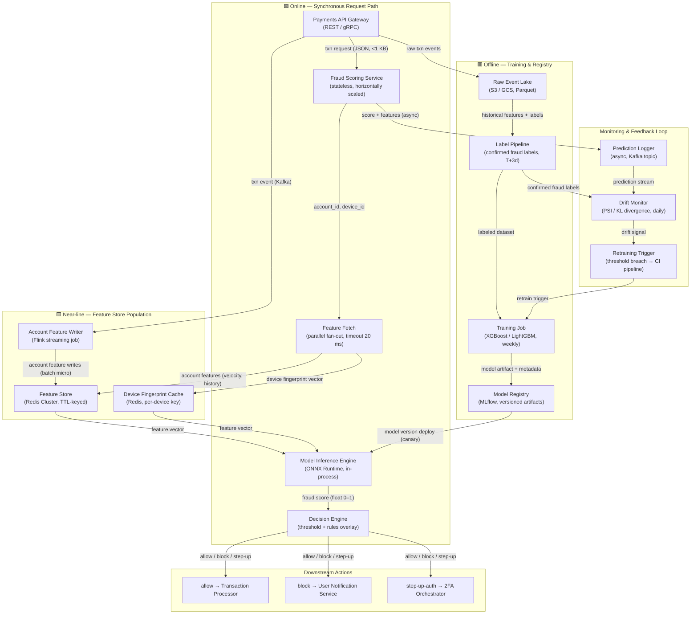

# Architecture: Real-Time Fraud Scoring

## Serving Boundary Legend
- 🟥 **Offline** — batch jobs, training, registry
- 🟨 **Near-line** — feature store population, async enrichment
- 🟩 **Online** — synchronous request path (latency-critical)

---

---

## Component Glossary

| Component | Role | SLA / Notes |
|---|---|---|
| Payments API Gateway | Entry point; routes txn to scoring service | — |
| Fraud Scoring Service | Orchestrates feature fetch + inference + decision | p95 ≤ 80 ms owner |
| Feature Fetch | Parallel Redis calls; 20 ms timeout with stale-fallback | Fan-out, not sequential |
| Model Inference Engine | ONNX Runtime, model loaded in-process | ~5–10 ms per score |
| Decision Engine | Converts score to action using threshold + rules | Rules can override model |
| Feature Store (Redis) | Account velocity, history; TTL-keyed per account | < 5 ms p99 read |
| Device Fingerprint Cache | Per-device feature vectors pre-computed | < 5 ms p99 read |
| Flink Streaming Job | Consumes txn events; updates account features near-real-time | Lag < 2 s |
| Raw Event Lake | Immutable audit log; source of truth for retraining | S3 / GCS |
| Label Pipeline | Joins fraud labels (T+3d) with prediction records | Weekly batch |
| Training Job | Retrains model on labeled data | Weekly or on drift trigger |
| Model Registry | Versioned artifacts; gates canary deploys | MLflow |
| Prediction Logger | Async Kafka write from scoring service | No latency impact |
| Drift Monitor | Computes PSI / KL divergence between score distributions | Daily job |
| Retraining Trigger | Fires CI pipeline if drift exceeds threshold | Automated |
